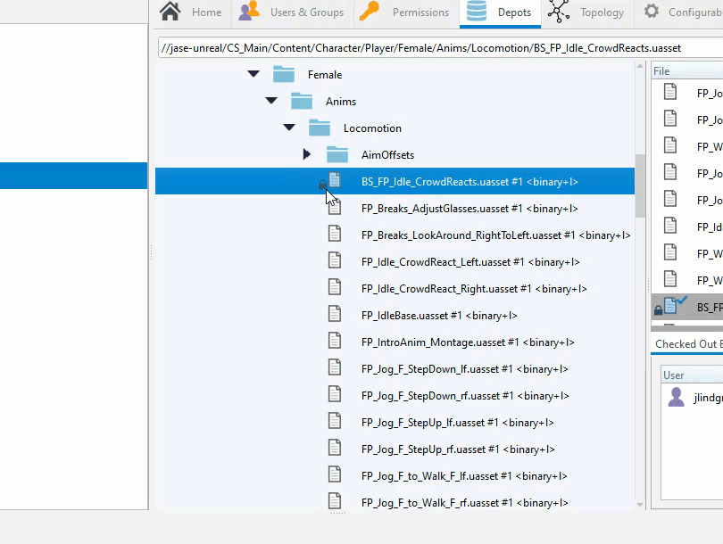
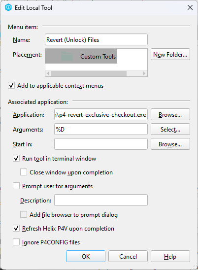
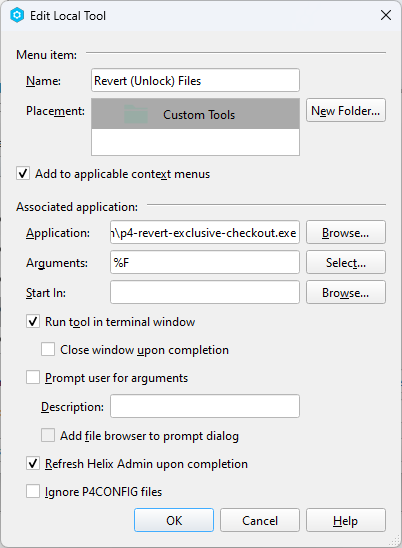

# p4-revert-exclusive-checkout
Tool for super users to revert files in other users' workspaces.
This is particularly useful for +l (exclusive checkout) files that are locked by a user who is not available to unlock them.

It can be installed as a custom tool in P4V and P4Admin but requires Super User access to run (you will get permissions errors otherwise).

## Usage
Once the tool is installed in P4V and/or P4Admin, you can run it by right-clicking
on a file or folder in the Depot view and selecting `Revert (Unlock) Files` or `Revert (Unlock) Folder`.

A window will pop up, showing all the files in the selected folder that are locked by other users.
You can press Enter (or the Reply button) to revert all the files, or exit to leave them checked out.

## Installation
To add the tool to P4V you only need to setup the tool once. For P4Admin, you will need to add it twice, once for files and once for folders.
The instructions are the same for both, except for the name of the tool and the `Arguments:` field.

1. Download the latest release from the [releases page](https://github.com/jase-perf/p4-revert-exclusive-checkout/releases)
2. In P4V, go to **Tools -> Manage Tools -> Custom Tools...**
3. Click **New -> Tool...**
4. Name it `Revert (Unlock) Folder` or `Revert (Unlock) Files` (or whatever you prefer)
5. Check the box for `Add to applicable context menus`
6. For **Application:** click Browse and select the downloaded executable
7. For **Arguments:** choose the argument for files or folder:
   1. P4V: In P4V, enter `%D` (Or click Select... and choose `Selected files or folders (depot syntax used)`)
   2. P4Admin Folder: Enter `%r` (Or click Select... and choose `Selected directory`)
   3. P4Admin Files: Enter `%F` (Or click Select... and choose `Selected files`)
8. Check the box for `Run tool in terminal window`
9. Check the box for `Refresh Helix P4V/Admin after completion`
10. Click **OK** to save the tool

#### P4V Example

#### P4Admin Example Files

#### P4Admin Example Folder

The tool is now available in the context menu for files and folders in P4V and P4Admin when you right click on them.